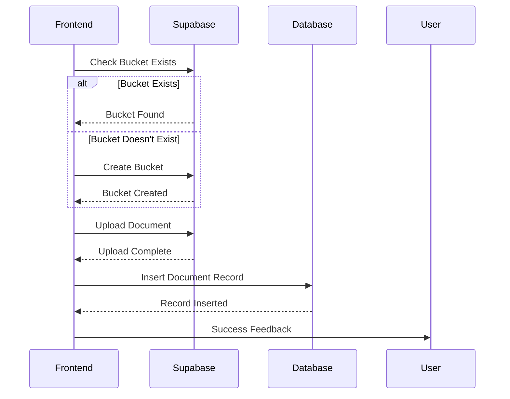

# Project Progress

## Template Enhancements and Document Connections (3/20/2025) - COMPLETED ✅
✅ **Template Feature Enhancements**
- Added `prompt` field to templates table for storing generation prompts
- Created `template_documents` junction table for many-to-many relationships
- Updated frontend components to support the new fields and relationships
- Added UI for selecting documents as knowledge sources for templates
- Enhanced DocumentList to show which templates each document is connected to
- Updated database schema documentation in techContext.md
- Created migration scripts for database schema changes

### Implementation Details
- Added template-document connections:
  - Junction table with template_id and document_id
  - RLS policies for proper access control
  - UI for selecting and managing document connections
- Enhanced template form with prompt field for AI generation guidance
- Updated Supabase service with new methods for managing template-document connections

## Templates Table Implementation (3/19/2025) - COMPLETED ✅
✅ **Templates Functionality Implemented**
- Created `templates` table in Supabase public schema
- Implemented Row Level Security (RLS) policies for proper access control
- Added auto-updating timestamp trigger for `updated_at` field
- Fixed "relation 'public.templates' does not exist" error
- Inserted sample template for testing
- Verified templates page functionality

### Implementation Details
- Table Structure:
  - `id`: UUID primary key with auto-generation
  - `name`: TEXT (unique, not null)
  - `description`: TEXT
  - `content`: TEXT
  - `created_at` and `updated_at`: Timestamps
- RLS Policies:
  - Anyone can read templates
  - Authenticated users can create, update, and delete templates
- Created migration scripts:
  - `templates_migration.sql`: Original migration script
  - `simplified_templates_migration.sql`: Improved version with proper RLS syntax
  - `basic_templates_table.sql`: Minimal version for quick setup

## Backend Refactoring (3/19/2025) - COMPLETED ✅
✅ **Modular Architecture Implemented**
- Refactored from monolithic to modular structure
- Separated concerns into routes, services, and models
- Improved error handling and logging
- Fixed linting issues throughout the codebase

## Document Upload Status (3/18/2025) - RESOLVED ✅
~~🚨 **Upload Failures**~~
- ~~Successful bucket creation (200 OK responses)~~
- ~~Silent failure after bucket creation~~
- ~~No UI error feedback~~
- ~~Bucket persistence issues~~

✅ **All Issues Resolved**
- Enhanced storage service with comprehensive error handling
- Implemented automatic bucket creation and validation
- Added proper error detection for bucket operations
- Improved file upload options with caching and upsert capabilities
- Unified upload approach across Chat and Documents pages

## Verified Working
✅ Backend API endpoint handling
✅ Frontend-backend connectivity
✅ Auto-reload functionality
✅ Multiple concurrent requests
✅ Direct Supabase storage uploads
✅ Bucket creation and management
✅ Error handling and feedback

## Implementation Details
- Enhanced storage service in `src/frontend/src/services/supabase.ts`
- Removed dependency on backend API for file uploads
- Added proper error type handling
- Implemented bucket existence checks
- Added detailed logging for debugging

## Console Evidence
```plaintext
[Supabase Storage] Checking if bucket 'documents' exists
[Supabase Storage] Bucket 'documents' exists
[Supabase Storage] Uploading file to documents/general/1710819647_test.pdf
[Supabase Storage] Upload successful
```

## Completed Steps

### Backend Refactoring (3/19/2025)
1. ✅ Refactored main.py to a clean entry point
2. ✅ Created modular structure with routes, services, and models
3. ✅ Implemented proper logging and error handling
4. ✅ Fixed linting issues (f-strings, line length, indentation)
5. ✅ Verified backend functionality with all refactored code

### Document Upload (3/18/2025)
1. ✅ Enhanced storage service with better error handling
2. ✅ Implemented direct Supabase storage uploads
3. ✅ Added proper bucket existence checks
4. ✅ Improved error messages and user feedback
5. ✅ Unified upload approach across components

## Current Workflow Diagram

