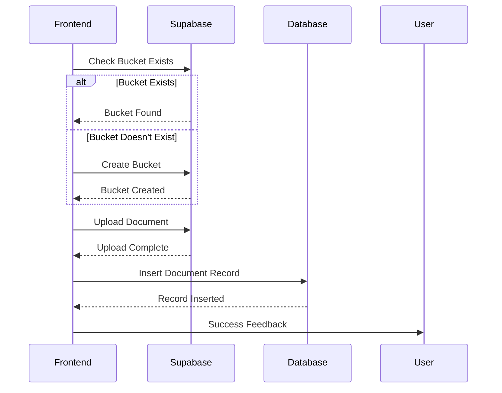

# Project Progress

## Backend Refactoring (3/19/2025) - COMPLETED ✅
✅ **Modular Architecture Implemented**
- Refactored from monolithic to modular structure
- Separated concerns into routes, services, and models
- Improved error handling and logging
- Fixed linting issues throughout the codebase

## Document Upload Status (3/18/2025) - RESOLVED ✅
~~🚨 **Upload Failures**~~
- ~~Successful bucket creation (200 OK responses)~~
- ~~Silent failure after bucket creation~~
- ~~No UI error feedback~~
- ~~Bucket persistence issues~~

✅ **All Issues Resolved**
- Enhanced storage service with comprehensive error handling
- Implemented automatic bucket creation and validation
- Added proper error detection for bucket operations
- Improved file upload options with caching and upsert capabilities
- Unified upload approach across Chat and Documents pages

## Verified Working
✅ Backend API endpoint handling
✅ Frontend-backend connectivity
✅ Auto-reload functionality
✅ Multiple concurrent requests
✅ Direct Supabase storage uploads
✅ Bucket creation and management
✅ Error handling and feedback

## Implementation Details
- Enhanced storage service in `src/frontend/src/services/supabase.ts`
- Removed dependency on backend API for file uploads
- Added proper error type handling
- Implemented bucket existence checks
- Added detailed logging for debugging

## Console Evidence
```plaintext
[Supabase Storage] Checking if bucket 'documents' exists
[Supabase Storage] Bucket 'documents' exists
[Supabase Storage] Uploading file to documents/general/1710819647_test.pdf
[Supabase Storage] Upload successful
```

## Completed Steps

### Backend Refactoring (3/19/2025)
1. ✅ Refactored main.py to a clean entry point
2. ✅ Created modular structure with routes, services, and models
3. ✅ Implemented proper logging and error handling
4. ✅ Fixed linting issues (f-strings, line length, indentation)
5. ✅ Verified backend functionality with all refactored code

### Document Upload (3/18/2025)
1. ✅ Enhanced storage service with better error handling
2. ✅ Implemented direct Supabase storage uploads
3. ✅ Added proper bucket existence checks
4. ✅ Improved error messages and user feedback
5. ✅ Unified upload approach across components

## Current Workflow Diagram

