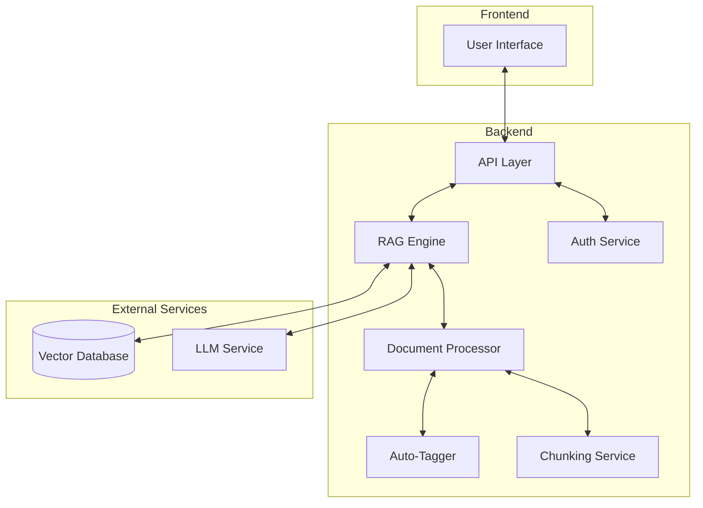
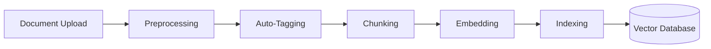
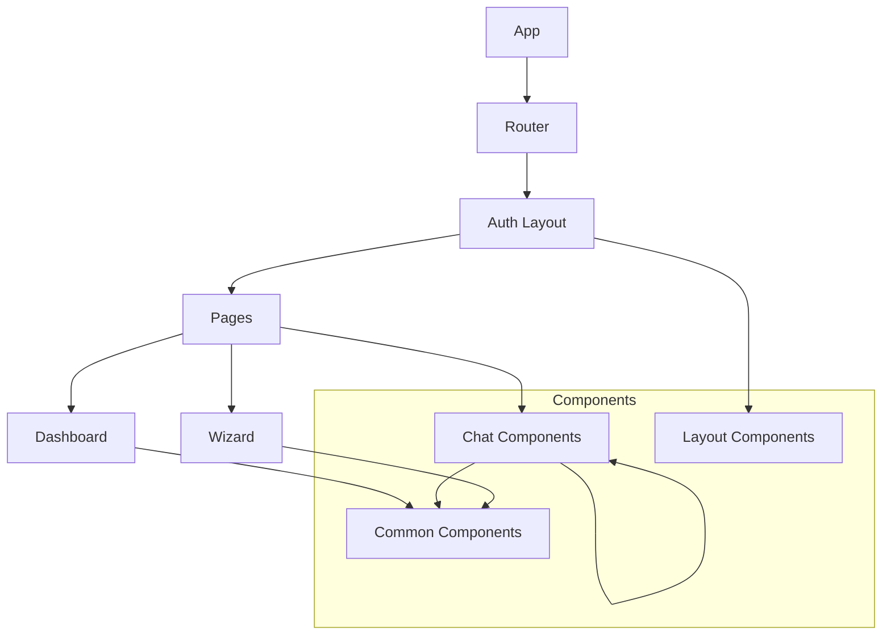
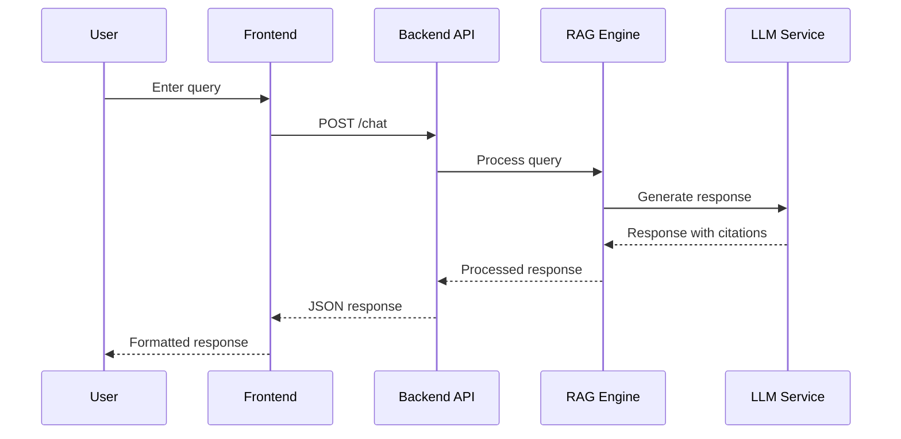
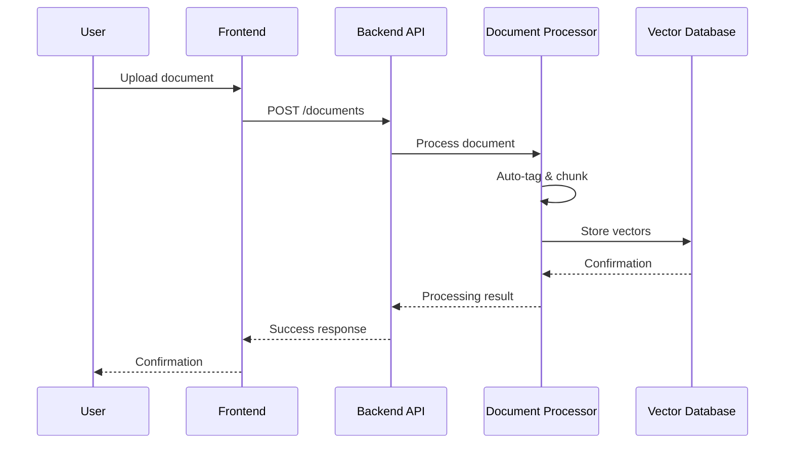
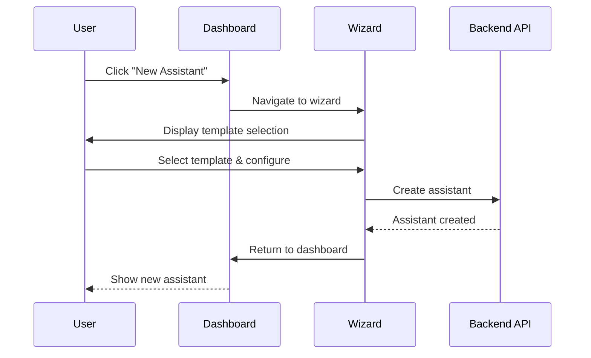

# Lexpert Case AI - System Patterns

## System Architecture

Lexpert Case AI follows a modern, modular architecture designed for scalability, maintainability, and performance:



## Key Technical Decisions

### 1. Retrieval-Augmented Generation (RAG) Approach

We've implemented a multi-layer RAG system:

- **Base Layer**: Contains general legal knowledge (Texas Family Code, Trademark Manual)
- **Case Layer**: Contains case-specific documents and context
- **Memory Layer**: Stores conversation history and user preferences

This approach allows for:

- Precise retrieval of relevant information
- Contextual awareness of case-specific details
- Personalized responses based on user history

### 2. Document Processing Pipeline



- **Preprocessing**: Converts various formats (PDF, DOCX) to plain text
- **Auto-Tagging**: Uses spaCy/Hugging Face to classify document types with 85%+ confidence
- **Chunking**: Segments documents into 500-token chunks with appropriate overlap
- **Embedding**: Generates vector representations using OpenAI embeddings
- **Indexing**: Stores vectors in Supabase pgvector with HNSW/IVF indexing

### 3. Frontend Architecture

The frontend follows a component-based architecture using React and TypeScript:



- **Common Components**: Reusable UI elements (Card, Button, Tooltip, etc.)
- **Chat Components**: Specialized for conversation UI (Message, Input, etc.)
- **Layout Components**: Page structure and navigation
- **Wizard**: Multi-step assistant creation process

## Design Patterns

### 1. Context Provider Pattern

We use React Context API for global state management:

```typescript
// Example: ThemeContext for dark/light mode
const ThemeContext = createContext<ThemeContextType | undefined>(undefined);

export const ThemeProvider: FC<{ children: ReactNode }> = ({ children }) => {
  const [isDarkMode, setIsDarkMode] = useState<boolean>(
    localStorage.getItem("darkMode") === "true"
  );

  // ... implementation ...

  return (
    <ThemeContext.Provider value={{ isDarkMode, toggleDarkMode }}>
      {children}
    </ThemeContext.Provider>
  );
};
```

This pattern allows for:

- Centralized state management
- Reduced prop drilling
- Component reusability

### 2. Repository Pattern (Backend)

The backend uses a repository pattern to abstract data access:

```python
# Example: BotRepository for accessing bot data
class BotRepository:
    def __init__(self, db_client):
        self.db_client = db_client

    async def get_bots_by_user(self, user_id):
        # Implementation

    async def create_bot(self, bot_data):
        # Implementation
```

This pattern provides:

- Separation of concerns
- Testability
- Flexibility to change data sources

### 3. Middleware Pattern

We use middleware for cross-cutting concerns:

```python
# Example: CORS middleware
app.add_middleware(
    CORSMiddleware,
    allow_origins=["http://localhost:5173"],
    allow_credentials=True,
    allow_methods=["*"],
    allow_headers=["*"],
)
```

Benefits include:

- Centralized handling of common concerns
- Clean separation of business logic
- Reusable request/response processing

### 4. Component Composition Pattern

We use component composition for building complex UI elements:

```typescript
// Example: Card component with composition
const Card: React.FC<CardProps> = ({
  children,
  title,
  subtitle,
  className = "",
  onClick,
  hoverable = false,
  accent = false,
}) => {
  const baseClasses =
    "bg-card rounded-lg shadow-sm p-4 border border-gray-200 dark:bg-gray-800 dark:border-gray-700";
  const hoverClasses =
    hoverable || onClick ? "cursor-pointer hover:shadow-md" : "";
  const accentClasses = accent ? "border-l-4 border-l-[#0078D4]" : "";

  const handleClick = (e: React.MouseEvent) => {
    if (onClick) {
      // Only stop propagation if this is a nested clickable element
      if (e.target !== e.currentTarget) {
        e.stopPropagation();
      }
      onClick();
    }
  };

  return (
    <div
      className={`${baseClasses} ${hoverClasses} ${accentClasses} ${className}`}
      onClick={handleClick}
      role={onClick ? "button" : undefined}
      tabIndex={onClick ? 0 : undefined}
      onKeyDown={(e) => {
        if (onClick && (e.key === "Enter" || e.key === " ")) {
          e.preventDefault();
          onClick();
        }
      }}
      data-clickable={onClick ? "true" : "false"}
    >
      {(title || subtitle) && (
        <div className="mb-3">
          {title && (
            <h3 className="text-lg font-medium text-gray-800 dark:text-gray-200">
              {title}
            </h3>
          )}
          {subtitle && (
            <p className="text-sm text-gray-500 dark:text-gray-400 mt-1">
              {subtitle}
            </p>
          )}
        </div>
      )}
      {children}
    </div>
  );
};
```

This pattern provides:

- Reusable UI components
- Consistent styling and behavior
- Improved accessibility
- Proper event handling

### 5. Templates System Pattern

The templates system follows a modular pattern with clear separation of concerns:

```mermaid
flowchart TD
    Templates[Templates Page] --> List[Template List]
    Templates --> Form[Add Template Form]
    Templates --> Edit[Edit Template]

    List --> Search[Search Filter]
    List --> Selection[Template Selection]

    Form --> Validation[Form Validation]
    Form --> Feedback[User Feedback]

    Edit --> Update[Update Template]
    Edit --> Delete[Delete Template]

    subgraph Access Control
        Admin[Admin Check]
        Role[Role Validation]
    end

    Templates --> Access Control
```

Key components and their responsibilities:

1. **Templates Page (`Templates.tsx`)**:

   - Manages admin access control
   - Handles template list and form layout
   - Provides navigation and context

2. **Template List (`TemplateList.tsx`)**:

   - Displays templates with search functionality
   - Handles template selection and navigation
   - Provides loading and error states
   - Implements responsive design

3. **Add Template Form (`AddTemplateForm.tsx`)**:

   - Validates input (name length, required fields)
   - Provides real-time user feedback
   - Handles form submission and errors
   - Implements tooltip guidance

4. **Edit Template (`EditTemplate.tsx`)**:
   - Manages template editing workflow
   - Handles template updates and validation
   - Provides success/error feedback
   - Implements navigation

Benefits:

- Clear separation of concerns
- Consistent error handling
- Reusable components
- Maintainable codebase

Example implementation:

```typescript
// Template interface for type safety
interface Template {
  id: string;
  name: string;
  description: string;
  created_at: string;
  updated_at: string;
}

// Role-based access control
const checkAdminStatus = async () => {
  const {
    data: { user },
  } = await supabase.auth.getUser();
  if (!user) return false;

  const { data: profile } = await supabase
    .from("profiles")
    .select("role")
    .eq("id", user.id)
    .single();

  return profile?.role === "admin";
};

// Form validation pattern
const validateTemplate = (name: string) => {
  if (name.length > 100) {
    return "Template name must be 100 characters or fewer.";
  }
  return null;
};

// Error handling pattern
const handleError = (error: any) => {
  if (error.code === "23505") {
    return "Template name already exists. Please choose a unique name.";
  }
  return `Unexpected error: ${
    error instanceof Error ? error.message : "Unknown error"
  }`;
};
```

This pattern ensures:

- Type safety with TypeScript
- Consistent error handling
- Clear validation rules
- Proper access control

## Component Relationships

### Frontend-Backend Communication



### Document Upload Flow



### Assistant Creation Flow



## Error Handling Strategy

We implement a comprehensive error handling approach:

1. **Frontend**: Try-catch blocks with user-friendly error messages
2. **API Layer**: HTTP status codes with detailed error responses
3. **Service Layer**: Custom exceptions with logging
4. **External Services**: Circuit breaker pattern for resilience

This multi-layered approach ensures:

- Graceful degradation
- Informative user feedback
- Comprehensive error logging
- System stability

## Theme System

### Theme Context Pattern

```typescript
// ThemeContext.tsx
interface ThemeContextType {
  isDarkMode: boolean;
  toggleDarkMode: () => void;
}

// Usage in components
const { isDarkMode, toggleDarkMode } = useTheme();
```

Key features:

- System preference detection
- Smooth transitions
- localStorage persistence
- Proper cleanup
- Accessibility support

### Theme Implementation

1. **Initialization**:

   ```typescript
   const [isDarkMode, setIsDarkMode] = useState<boolean>(() => {
     const savedTheme = localStorage.getItem("darkMode");
     if (savedTheme !== null) {
       return savedTheme === "true";
     }
     return window.matchMedia("(prefers-color-scheme: dark)").matches;
   });
   ```

2. **Effect Handling**:
   ```typescript
   useEffect(() => {
     document.body.classList.add("transition-colors", "duration-200");
     document.documentElement.classList.toggle("dark", isDarkMode);
     localStorage.setItem("darkMode", isDarkMode.toString());
     return () => {
       document.body.classList.remove("transition-colors", "duration-200");
     };
   }, [isDarkMode]);
   ```

## Navigation System

### Keyboard Shortcuts Pattern

```typescript
useEffect(() => {
  const handleKeyPress = (e: KeyboardEvent) => {
    if (e.altKey && e.key === "b") {
      e.preventDefault();
      navigate("/");
    }
    // ... other shortcuts
  };
  window.addEventListener("keydown", handleKeyPress);
  return () => window.removeEventListener("keydown", handleKeyPress);
}, [navigate]);
```

### Breadcrumb Navigation Pattern

```typescript
<nav aria-label="Breadcrumb">
  <ol className="flex items-center space-x-2">
    <li>
      <a
        href="/"
        onClick={(e) => {
          e.preventDefault();
          navigate("/");
        }}
      >
        Lexpert Case AI
      </a>
    </li>
    <li className="flex items-center">
      <svg
        className="h-4 w-4 text-gray-400"
        fill="currentColor"
        viewBox="0 0 20 20"
      >
        <path
          fillRule="evenodd"
          d="M7.293 14.707a1 1 0 010-1.414L10.586 10 7.293 6.707a1 1 0 011.414-1.414l4 4a1 1 0 010 1.414l-4 4a1 1 0 01-1.414 0z"
          clipRule="evenodd"
        />
      </svg>
      <span className="ml-2">{currentPage}</span>
    </li>
  </ol>
</nav>
```

## Accessibility Patterns

### Focus Management

```typescript
// Focus styles
:focus-visible {
  outline: 2px solid #0078D4;
  outline-offset: 2px;
}

// Hide focus for mouse users
:focus:not(:focus-visible) {
  outline: none;
}
```

### ARIA Labels

```typescript
<button aria-label="Return to dashboard (Alt+B)" accessKey="b" className="...">
  Return to Dashboard
</button>
```

## Performance Patterns

### Transition Optimization

```css
/* Smooth transitions for all color changes */
* {
  transition-property: background-color, border-color, color, fill, stroke,
    opacity, box-shadow, transform;
  transition-timing-function: cubic-bezier(0.4, 0, 0.2, 1);
  transition-duration: 200ms;
}
```

### Event Cleanup

```typescript
useEffect(() => {
  // Setup
  const handleEvent = () => {};
  window.addEventListener("event", handleEvent);

  // Cleanup
  return () => {
    window.removeEventListener("event", handleEvent);
  };
}, []);
```

## Component Patterns

### Button Pattern

```typescript
<button
  className={`
    p-2 rounded-full transition-colors
    ${
      isActive
        ? "bg-[#0078D4] text-white hover:bg-[#0078D4]/90"
        : "bg-gray-200 dark:bg-gray-700 text-gray-700 dark:text-gray-300 hover:bg-gray-300 dark:hover:bg-gray-600"
    }
  `}
  aria-label={isActive ? "Deactivate" : "Activate"}
  accessKey="k"
>
  {icon}
</button>
```

### Input Pattern

```typescript
<input
  type="text"
  className="
    flex-1 py-2 px-4 
    bg-white dark:bg-gray-700 
    border border-gray-300 dark:border-gray-600 
    rounded-md shadow-sm 
    focus:outline-none focus:ring-2 focus:ring-[#0078D4] focus:border-transparent 
    text-gray-900 dark:text-gray-100
  "
  aria-label="Input field"
/>
```

## State Management Patterns

### Theme State

```typescript
// Theme state management
const [isDarkMode, setIsDarkMode] = useState<boolean>(() => {
  const savedTheme = localStorage.getItem("darkMode");
  if (savedTheme !== null) {
    return savedTheme === "true";
  }
  return window.matchMedia("(prefers-color-scheme: dark)").matches;
});
```

### Voice Input State

```typescript
// Voice input state management
const [isVoiceInput, setIsVoiceInput] = useState(false);
const recognition = useRef<any>(null);

const toggleVoiceInput = () => {
  if (isVoiceInput) {
    recognition.current?.stop();
    recognition.current = null;
    setIsVoiceInput(false);
  } else {
    // Start voice input
  }
};
```

## Error Handling Patterns

### Theme Error Handling

```typescript
try {
  const savedTheme = localStorage.getItem("darkMode");
  if (savedTheme !== null) {
    return savedTheme === "true";
  }
} catch (error) {
  console.error("Error reading theme preference:", error);
  return window.matchMedia("(prefers-color-scheme: dark)").matches;
}
```

### Voice Input Error Handling

```typescript
try {
  const SpeechRecognition =
    window.SpeechRecognition || window.webkitSpeechRecognition;
  if (!SpeechRecognition) {
    throw new Error("Speech recognition not supported");
  }
  // Initialize speech recognition
} catch (error) {
  console.error("Error initializing voice input:", error);
  // Fallback to text input
}
```

## Component Architecture

### Templates System

The Templates feature follows a modular architecture with clear separation of concerns:

1. **Components**:

   - `Templates.tsx`: Page component managing admin access and template operations
   - `TemplateList.tsx`: Presentational component for displaying templates
   - `AddTemplateForm.tsx`: Form component for template creation

2. **Data Flow**:

   ```mermaid
   flowchart TD
       Templates[Templates Page] --> CheckAdmin[Check Admin Status]
       Templates --> List[Template List]
       Templates --> Form[Add Template Form]
       Form --> Supabase[(Supabase DB)]
       List --> Supabase
   ```

3. **Access Control**:

   - Admin status checked via Supabase profiles table
   - Template creation restricted to admin users
   - Template viewing available to all authenticated users

4. **State Management**:

   - Local state for template list and form
   - Refresh trigger for list updates
   - Loading and error states for async operations

5. **Database Schema**:
   ```sql
   CREATE TABLE lexpert.templates (
     id UUID PRIMARY KEY DEFAULT uuid_generate_v4(),
     name TEXT NOT NULL,
     description TEXT,
     created_at TIMESTAMP WITH TIME ZONE DEFAULT NOW(),
     updated_at TIMESTAMP WITH TIME ZONE DEFAULT NOW()
   );
   ```

## Architecture Overview

### Document Management

1. **Storage Pattern**

   ```mermaid
   flowchart TD
     A[Admin User] -->|Upload| B[Documents Page]
     B -->|Store File| C[Supabase Storage]
     B -->|Store Metadata| D[lexpert.documents]
     C -->|Private URL| E[Authenticated Users]
     D -->|Query| E
   ```

2. **Access Control Flow**

   ```mermaid
   flowchart TD
     A[User Request] -->|Check Auth| B{Authenticated?}
     B -->|No| C[Redirect to Login]
     B -->|Yes| D{Check Role}
     D -->|Admin| E[Full Access]
     D -->|User| F[View Only]
   ```

3. **Document Upload Flow**
   ```mermaid
   flowchart TD
     A[Select File] -->|Validate| B{File Type Check}
     B -->|Invalid| C[Show Error]
     B -->|Valid| D[Upload to Storage]
     D -->|Success| E[Store Metadata]
     D -->|Error| C
     E -->|Success| F[Show Success]
     E -->|Error| C
     F --> G[Refresh List]
   ```

## Design Patterns

### Component Patterns

1. **Document Upload**

   - Controlled file input
   - Progress feedback
   - Error handling
   - Success confirmation
   - Auto-refresh on success

2. **Document List**
   - Tag-based filtering
   - Pagination (planned)
   - Sort options (planned)
   - Search (planned)

### Data Patterns

1. **Document Storage**

   ```typescript
   interface Document {
     id: UUID;
     name: string;
     path: string;
     tag: string;
     created_at: Date;
     updated_at: Date;
     created_by: UUID;
     metadata: JsonB;
   }
   ```

2. **File Naming**
   ```
   documents/[timestamp]-[sanitized-name]
   ```

### Security Patterns

1. **RLS Policies**

   - Admin-only write access
   - Authenticated read access
   - Storage bucket policies
   - Database table policies

2. **File Validation**
   - Type checking
   - Name sanitization
   - Size limits (planned)

### UI Patterns

1. **Feedback System**

   - Success messages (3s display)
   - Error messages (5s display)
   - Loading states
   - Disabled states during upload

2. **Layout**
   - Responsive grid
   - Card-based document list
   - Action buttons in header
   - Status messages below header

## Technical Implementation

### Database Schema

```sql
CREATE TABLE lexpert.documents (
    id UUID DEFAULT gen_random_uuid() PRIMARY KEY,
    name TEXT NOT NULL,
    path TEXT NOT NULL,
    tag TEXT DEFAULT 'untagged',
    created_at TIMESTAMPTZ DEFAULT NOW(),
    updated_at TIMESTAMPTZ DEFAULT NOW(),
    created_by UUID REFERENCES auth.users(id),
    metadata JSONB DEFAULT '{}'::jsonb
);
```

### Storage Configuration

```sql
INSERT INTO storage.buckets (id, name, public)
VALUES ('documents', 'documents', false);

-- RLS Policies for storage
CREATE POLICY "Admin full access storage"
    ON storage.objects FOR ALL TO authenticated
    USING (auth.jwt() ->> 'role' = 'admin')
    WITH CHECK (auth.jwt() ->> 'role' = 'admin');
```

### Component Structure

```typescript
// Documents.tsx
const Documents: React.FC = () => {
  // State
  const [isAdmin, setIsAdmin] = useState(false);
  const [documents, setDocuments] = useState<Document[]>([]);
  const [status, setStatus] = useState<Status>(null);

  // Handlers
  const handleUpload = async (file: File) => {
    // Upload logic
  };

  // Render
  return (
    <Layout>
      <Header />
      <UploadSection />
      <DocumentList />
    </Layout>
  );
};
```

## Error Handling

1. **Upload Errors**

   - File type mismatch
   - Storage errors
   - Database errors
   - Network issues

2. **Access Errors**

   - Authentication required
   - Admin role required
   - Storage permission denied

3. **Recovery Patterns**
   - Automatic retry on network issues
   - Clear error state after timeout
   - Reset form on success
   - Refresh data on success
